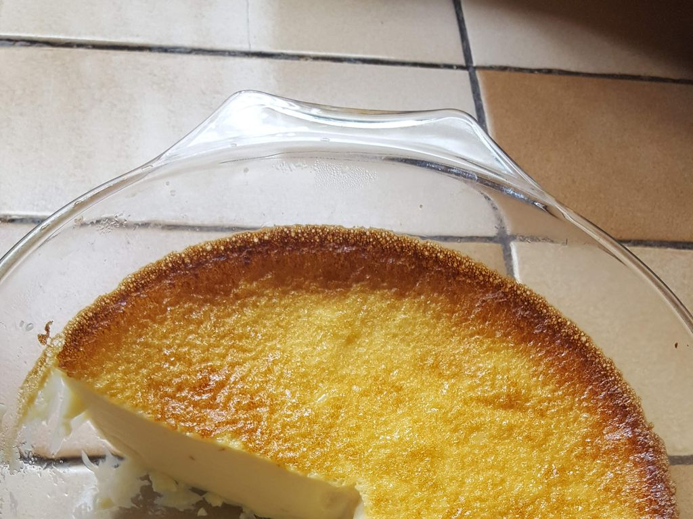

Oeufs au lait (eggs with milk)

* Servings: 6
* Prep Time: 10 mins
* Cook Time: 40 mins

Ingredients:

* 1 quart Half & Half milk
* 6 eggs
* 6 Tablespoons sugar
* vanilla extract

Directions:

1. Boil 1 quart of Half & Half milk with some sugar (6 Tablespoons) and vanilla, and let cool a bit
2. In a flat oven dish, whisk 6 eggs, then add the warm milk while stirring
3. Stick into the oven (no need to preheat), set to 350F (180c) until browning on top (20-40 minutes?)
4. Chill and enjoy

Notes:

* Not preheating the oven helps to get a silky smooth texture, rather than curdling the custard.

