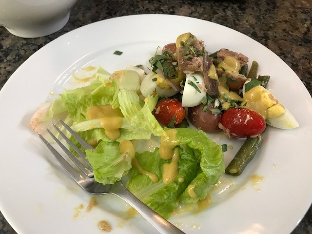

Salade Niçoise

* Servings: 6
* Prep Time: 20 mins
* Cook Time: 30 mins

Ingredients:

* 0.5 pound green beans (boiled, bite sized)
* 0.5 pound small potatoes (halfed or quartered, and boiled) 
* 4 hard-cooked eggs (quartered)
* 2 tomatoes (sliced) or a small container of cherry tomatoes
* 2 small cans of tuna
* lettuce
* some chopped tarragon
* some capers, anchovies, chopped black olives to taste

Directions:

1. Boil the green beans
2. Cut and boil the potatoes (can re-use the pot and water)
3. Cut the cooled beans
4. Make the dressing: Dijon mustard, red vinegar, olive oil (no salt necessary since salad toppings are salty)
5. Assemble :-)

